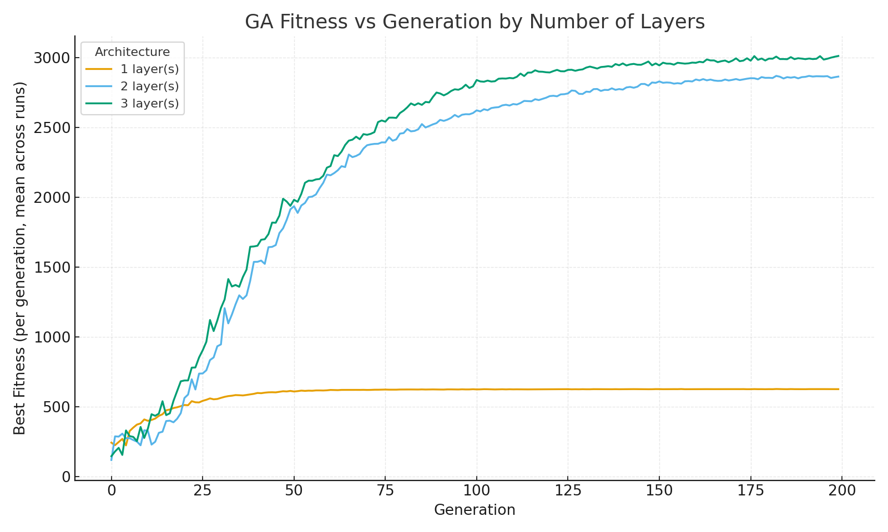

# Maze‑AI: Genetic‑Algorithm Macro‑Policy for Dynamic Grid Combat (Research‑in‑Progress)

[](#quickstart--reproducibility)
[](#quickstart--reproducibility)
[](#method)
[](#project-status--roadmap)
[](#license)

> **Abstract —** We study macro‑action selection in a dynamic grid arena with **destructible/buildable walls**, **continuous laser damage**, and **teleportation**. An agent’s policy (linear or 1‑layer MLP) is **evolved** from **human gameplay logs** via a **margin‑based Genetic Algorithm (GA)**, while **A\*** provides path planning for approach/escape. We define a reproducible pipeline (Unity prototype, logging, GA training) and a planned evaluation protocol (win‑rate vs scripted baselines, time‑to‑capture/escape, DPS, path optimality, robustness to occlusion/latency). This repository is **ongoing research**; formal results and ablations will be added as experiments complete.

---
<video controls playsinline preload="metadata" style="max-width:100%;height:auto;"
       src="https://github.com/<USER>/<REPO>/blob/<BRANCH>/docs/GA_MAZE_output.mov?raw=1">
</video>


---

## Highlights
- **Dynamic arena:** Procedural maze (perfect maze + loop additions), **destructible walls**, player‑placed **barriers**, and **teleportation**.
- **Two resources:** Health (non‑regenerating) and Chakra (recharging) with HUD + in‑world bars.
- **Macro‑policy:** Seven macro‑actions (Laser, Blocking, Hindering, Escaping, ShowingUp, Teleport, Charging).
- **Learning from humans:** GA fits policies to **human action logs** using a **margin** objective.
- **Planned, rigorous evaluation:** baselines, metrics, statistical tests, and robustness checks.
- **Reproducibility:** single‑player and network scenes, built‑in logger, one‑click GA training.

---

## Research Questions & Hypotheses
- **RQ1 — Can low‑capacity policies** (linear / small MLP) **match scripted baselines** in a dynamic, partially observed arena?
- **RQ2 — Does adding a small MLP** improve robustness under occlusion/latency relative to linear policies?
- **RQ3 — What is the effect of GA hyperparameters** (quantization levels, mutation rate, elites) on sample efficiency and final performance?

**Hypotheses** (to be tested):
- **H1:** Linear GA policies match a hand‑tuned FSM/BT baseline over short horizons.  
- **H2:** A 1‑layer MLP policy improves robustness without harming sample efficiency.  
- **H3:** Quantization finer than 21 levels shows diminishing returns.

---

## Method

### Arena & Mechanics
The maze is generated by DFS to form a perfect maze, then additional walls are removed with probability to introduce loops.

$$
\text{Grid size: } m \times n, \qquad \text{Loop probability: } p_{\mathrm{loop}} \in [0,1].
$$

**Laser damage** accumulates continuously per frame \( \Delta t \):

$$
\Delta H_t = d\\Delta t
$$

where $d$ is the constant damage rate while the beam intersects a target.

**Teleportation** has a distance‑dependent cost:

$$
\mathrm{Cost}_{\mathrm{TP}}(k) \=\ c_0 + c_1k, \qquad k \in \mathbb{N}.
$$

### State, Actions, and Policies
We discretize gameplay into a compact state and seven macro‑actions:

$$
\mathcal{A} = \{\texttt{Laser},\,\texttt{Blocking},\,\texttt{Hindering},\,\texttt{Escaping},\,\texttt{ShowingUp},\,\texttt{Teleport},\,\texttt{Charging}\} \quad (|\mathcal{A}|=7).
$$

State vector (normalized scalars / binary flags):

$$
\mathbf{s} = [s_1, s_2, s_3, s_4, s_5\]^\top \in \mathbb{R}^5,
\quad
\begin{aligned}
&s_1=\texttt{dtile}\in[0,1],\\
&s_2 \in \{0,1\}\ \text{(line of sight)},\\
&s_3 \in \{0,1\}\ \text{(opponent being hit)},\\
&s_4 \in \{0,1\}\ \text{(self being hit)},\\
&s_5=\chi \in [0,1]\ \text{(normalized chakra)}.\\
\end{aligned}
$$

**Linear policy**: Each action $a \in \mathcal{A}$ has weights $\mathbf{w}^{(a)} \in \mathbb{R}^5$ (5-D vector). We score actions by a dot product and choose the maximum:

$$
\mathrm{Score}(a \mid \mathbf{s}) \=\ \mathbf{w}^{(a)} \cdot \mathbf{s}
\=\ \sum_{j=1}^{5} w^{(a)}_j s_j,
\qquad
a^* \=\ \arg\max_{a \in \mathcal{A}} \mathrm{Score}(a \mid \mathbf{s}).
$$

**Optional MLP policy** (1 hidden layer):

$$
\mathbb{R}^5 \\to\ \mathbb{R}^6 \\to\ \mathbb{R}^6 \\to\ \mathbb{R}^7.
$$


### Learning from Human Logs (Margin Objective)
From multiplayer sessions we log constraints $(\mathbf{s}_c, a_c)$ — the state and the human-chosen action. We train by preferring the chosen action over all others:

$$
\mathbf{w}^{(a_c)} \cdot \mathbf{s}_c \>\ \mathbf{w}^{(b)} \cdot \mathbf{s}_c, \qquad \forall\, b \neq a_c.
$$

We maximize a summed margin‑style fitness over all constraints \( \mathcal{C} \):

$$
F(\mathbf{W}) \=\
\sum_{(\mathbf{s}_c,a_c) \in \mathcal{C}} \
\sum_{b \in \mathcal{A},\, b \neq a_c}
\Big(\mathbf{w}^{(a_c)} - \mathbf{w}^{(b)}\Big)\cdot \mathbf{s}_c.
$$

### Genetic Algorithm
We concatenate all action weights into a genome and evolve under selection, crossover, and mutation.

$$
\mathbf{W} = \big[\\mathbf{w}^{(1)} \mid \mathbf{w}^{(2)} \mid \cdots \mid \mathbf{w}^{(7)}\\big] \in \mathbb{R}^{7 \times 5}
\ \longrightarrow\
\text{vec}(\mathbf{W}) \in \mathbb{R}^{35},
$$

$$
w_j \in \{-1, -0.9, \ldots, 0.9, 1\} \quad \text{(21 quantization levels)}.
$$

### GA Workflow

1. Initialize a population $P$ with quantized genes.
2. Evaluate each candidate $\mathbf{W}_i$ by computing $F(\mathbf{W}_i)$ on the constraint log.
3. Select parents via tournament selection.
4. Crossover genomes (one-point or uniform) to form offspring.
5. Mutate a fraction $\mu$ of genes (random level flips; optional Gaussian jitter before requantization).
6. **Elitism:** carry the top $E$ individuals unchanged.
7. Repeat for $G$ generations or until validation fitness saturates.

*Symbols:* $P$ = population size, $\mathbf{W}_i$ = individual’s weights, $F$ = fitness, $\mu$ = mutation rate, $E$ = number of elites, $G$ = number of generations.

---

## Results

### Fitness vs. Generation (by Layers)

<p align="center">
  
</p>

The figure shows that adding hidden layers improves the agent’s fitness, reflecting better play and richer pattern capture. However, the 3-layer MLP lags early and often plateaus near the 2-layer curve, suggesting that the extra capacity isn’t realized under the current GA settings.

---

## Planned Evaluation Protocol
**Baselines**  
- Hand‑tuned FSM/BT bot  
- Behavior Cloning (supervised policy)  
- GA‑Linear vs GA‑MLP (ablations)

**Metrics**  
- Win rate (best‑of‑N), time‑to‑capture/escape  
- Damage per second (DPS), average path optimality vs A\*  
- Robustness under occlusion; latency/jitter stress tests

**Statistical Procedure**  
- Fixed RNG seeds; \( N \ge 100 \) matches per setting  
- 95% CIs via bootstrap; paired tests for ablations  
- Train/validation split of logs; held‑out maps

> **Note:** This project is **ongoing research**. Formal experiments and plots will be added upon completion of the above protocol.

---

## Quickstart & Reproducibility

### Requirements
- Unity **2021 LTS** or newer (URP/HDRP not required)  
- Mirror Networking (UPM) for Host/Client  
- .NET (C#) — Unity default

### Run the Prototype
1. Open `Scenes/SinglePlayer.unity` (single‑player) or `Scenes/Network.unity` (network).  
2. Controls (default):  
   - Fire Laser: hold **Mouse0**  
   - Barrier: **Q** (toggle/timeout)  
   - Teleport mode: **E** (adjust distance with scroll or **W/S**, confirm **E**)  
   - Charge Chakra: **C** (slows movement)

### Collect Human Logs
- Play network matches; logs are saved as JSON constraints:
```json
{
            "state": [
                0.15811388194561006,
                1.0,
                0.0,
                0.0,
                0.9698895812034607
            ],
            "chosenAction": "escaping",
            "epsilon": 0.009999999776482582,
            "timestamp": 87.76191711425781
        },
```
- Default path: `Logs/constraints/*.json` (configurable in `GAOptimizer`).

### Train the GA Policy
1. In `Bootstrap/GAOptimizer`: set population \( P \), generations \( G \), mutation rate \( \mu \), elites \( E \), quantization levels, seed.  
2. Click **Train** (Play Mode) or use the editor tool.  
3. Best weights saved to `Assets/Resources/Policy/best_policy.json` and auto‑loaded at runtime.

---

## Configuration (key parameters)
- **Maze:** `(rows, cols)`, cell size, loop probability `p_loop`  
- **Resources:** `H_max`, `chi_max`, recharge rate `r`, charge multiplier, UI timeouts  
- **Laser:** damage rate `d`, chakra cost per second  
- **Barrier:** lifetime `tau`, chakra cost, cooldown  
- **Teleport:** base cost `c0`, per‑tile cost `c1`, cooldown  
- **GA:** `P`, `G`, `mu`, elites `E`, tournament size, crossover type  
- **Logging:** constraint JSON path, sampling period

---

## Project Status & Roadmap
**Status:** In progress (active development). A playable prototype, logging pipeline, and GA training loop are implemented.  
**Not yet included:** formal performance analysis of the AI agent (metrics, baselines, ablations).

**Next milestones**
- Implement full evaluation suite and report (plots + tables)  
- Ablations: GA‑Linear vs GA‑MLP; quantization levels; tournament size; \( \mu \), \( E \)  
- Robustness: occlusion, latency/jitter; larger maze curriculum  
- Visualization: policy heatmaps; rollout GIFs; failure modes

If you’re reviewing this for admissions (e.g., MBZUAI), interim results can be shared upon request.

---

## Citation
If you build on this work, please cite the repository:

```bibtex
@misc{mazeai_ga,
  title        = {Maze-AI: Genetic-Algorithm Macro-Policy for Dynamic Grid Combat (Research-in-Progress)},
  author       = {Rashwan, Omar},
  year         = {2025},
  howpublished = {GitHub repository},
  note         = {Unity, Genetic Algorithm, A*, dynamic maze, continuous laser}
}
```

